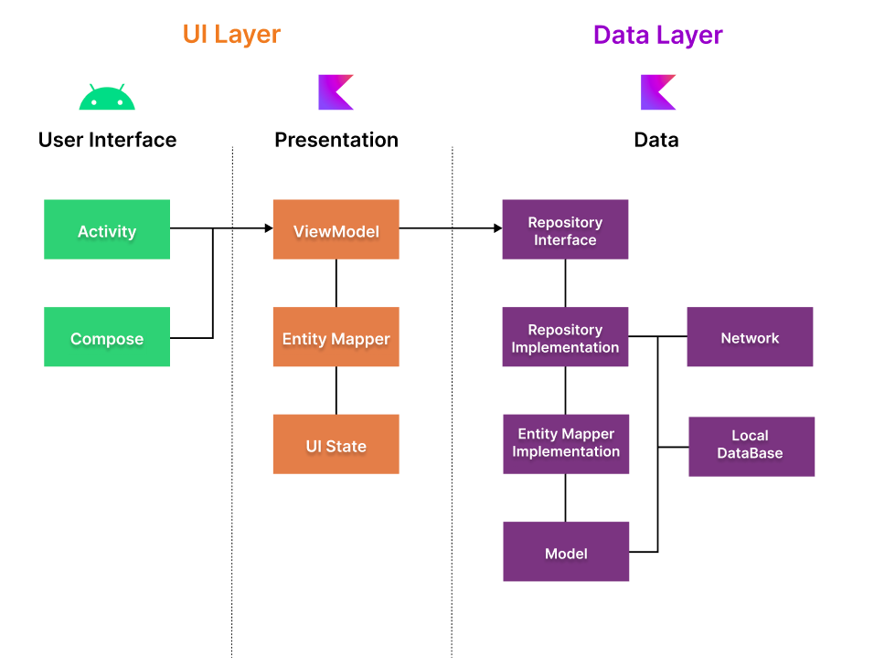
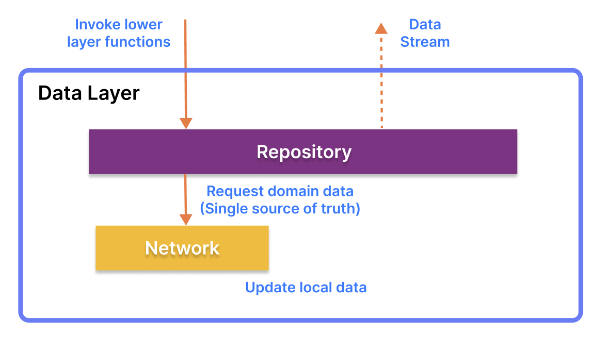

<p align="center">
  <a href="https://opensource.org/licenses/Apache-2.0"></a>
  <a href="https://android-arsenal.com/api?level=21"></a>
  <a href="https://github.com/getstream/ai-chat-android/actions/workflows/android.yml"></a>
</p>

**AI Chat Android** demonstrates [Google's Generative AI](https://android-developers.googleblog.com/2023/12/leverage-generative-ai-in-your-android-apps.html) on Android with [Firebase Realtime Database](https://firebase.google.com/docs/database).

The purpose of this repository is to demonstrate below:

- Demonstrates [Gemini API](https://ai.google.dev/tutorials/android_quickstart) for Android and handle the chunk stream responses as UI states.
- Implementing entire UI elements with Jetpack Compose.
- Implementation of Android architecture components with Jetpack libraries such as Hilt.
- Performing background tasks with Kotlin Coroutines.
- Integrating chat systems with [Firebase Realtime Database](https://firebase.google.com/docs/database) for handling real-time events.

## 📷 Previews

<p align="center">


</br>
</p>

## ✍️ Technical Content

If you're interested in the overall architecture, each layer, Generative AI, Gemini SDK, and implementation details of this project, check out the following blog post: **[Build an AI Chat Android App With Google’s Generative AI](https://getstream.io/blog/android-generative-ai/)**

<a href="https://getstream.io/chat/sdk/compose?utm_source=Github&utm_medium=Jaewoong_OSS&utm_content=Developer&utm_campaign=Github_Dec2024_Jaewoong_Gemini&utm_term=DevRelOs">

</a>

## 🛥 Stream Chat & Video SDK

__[Stream Chat SDK for Compose](https://getstream.io/chat/sdk/compose?utm_source=Github&utm_medium=Jaewoong_OSS&utm_content=Developer&utm_campaign=Github_Dec2024_Jaewoong_Gemini&utm_term=DevRelOss)__ allows you to implement messaging systems seamlessly. If you’re interested in building powerful real-time video/audio calling, audio room, and livestreaming, check out the __[Stream Video SDK for Compose](https://getstream.io/video/docs/android/tutorials/video-calling?utm_source=Github&utm_medium=Jaewoong_OSS&utm_content=Developer&utm_campaign=Github_Dec2024_Jaewoong_Gemini&utm_term=DevRelOss)__!

### Stream Chat

- [Stream Chat SDK for Android on GitHub](https://github.com/getStream/stream-chat-android)
- [Android Samples for Stream Chat SDK on GitHub](https://github.com/getStream/android-samples)
- [Stream Chat Compose UI Components Guidelines](https://getstream.io/chat/docs/sdk/android/compose/overview/)

### Stream Video

- [Stream Video SDK for Android on GitHub](https://github.com/getstream/stream-video-android?utm_source=Github&utm_medium=Jaewoong_OSS&utm_content=Developer&utm_campaign=Github_Dec2024_Jaewoong_Gemini&utm_term=DevRelOss)
- [Video Call Tutorial](https://getstream.io/video/docs/android/tutorials/video-calling?utm_source=Github&utm_medium=Jaewoong_OSS&utm_content=Developer&utm_campaign=Github_Dec2024_Jaewoong_Gemini&utm_term=DevRelOss)
- [Audio Room Tutorial](https://getstream.io/video/docs/android/tutorials/audio-room?utm_source=Github&utm_medium=Jaewoong_OSS&utm_content=Developer&utm_campaign=Github_Dec2024_Jaewoong_Gemini&utm_term=DevRelOss)
- [Livestream Tutorial](https://getstream.io/video/docs/android/tutorials/livestream?utm_source=Github&utm_medium=Jaewoong_OSS&utm_content=Developer&utm_campaign=Github_Dec2024_Jaewoong_Gemini&utm_term=DevRelOss)

## 💻 How to build the project?

To build this project properly, you should follow the instructions below: 

1. Following the [Firebase setup guidelines](https://firebase.google.com/docs/android/setup), download the **google-services.json** and place it into the `app` directory on this project.

2. Next, set up the [Firebase Realtime Database](https://firebase.google.com/docs/database) in your Firebase dashboard. Once that's done, you can import the JSON file like the image below:


3. Next, create a file named `secrets.properties` in the root directory of this project, and copy & paste your Realtime Database URL into it, as shown in the example below:


```
REALTIME_DATABASE_URL=..
```

4. Go to **[Google AI Studio](https://makersuite.google.com/app/apikey)**, login with your Google account and select the **Get API key** on the menu left like the image below:


5. Create your API key for using generative AI SDKs, and you'll get one like the image below:


6. Add the key to the `secrets.properties` file like the below:


```gradle
GEMINI_API_KEY=..
REALTIME_DATABASE_URL=..
```

7. Build and run the project.

## 🛠 Tech Stack & Open Source Libraries
- Minimum SDK level 24.
- 100% [Jetpack Compose](https://developer.android.com/jetpack/compose) based + [Coroutines](https://github.com/Kotlin/kotlinx.coroutines) + [Flow](https://kotlin.github.io/kotlinx.coroutines/kotlinx-coroutines-core/kotlinx.coroutines.flow/) for asynchronous.
- Jetpack
  - Compose: Android’s modern toolkit for building native UI.
  - ViewModel: UI related data holder and lifecycle aware.
  - Navigation: For navigating screens and [Hilt Navigation Compose](https://developer.android.com/jetpack/compose/libraries#hilt) for injecting dependencies.
  - [Hilt](https://dagger.dev/hilt/): Dependency Injection.
- [Landscapist Glide](https://github.com/skydoves/landscapist#glide), [animation](https://github.com/skydoves/landscapist#animation), [placeholder](https://github.com/skydoves/landscapist#placeholder): Jetpack Compose image loading library that fetches and displays network images with Glide, Coil, and Fresco.
- [Firebase Android KTX](https://github.com/skydoves/firebase-android-ktx): Kotlin & Compose-friendly Firebase extensions designed to help you focus on your business logic.
- [ksp](https://github.com/google/ksp): Kotlin Symbol Processing API.
- [Balloon](https://github.com/skydoves/balloon): Modernized and sophisticated tooltips, fully customizable with an arrow and animations for Android.
- [Baseline Profiles](https://getstream.io/blog/android-baseline-profile/): To improve app performance by including a list of classes and methods specifications in your APK that can be used by Android Runtime.

## 🏛️ Architecture

**AI Chat Android** follows the [Google's official architecture guidance](https://developer.android.com/topic/architecture).



**AI Chat Android** was built with [Guide to app architecture](https://developer.android.com/topic/architecture), so it would be a great sample to show how the architecture works in real-world projects.<br>

The overall architecture is composed of two layers; UI Layer and the data layer. Each layer has dedicated components and they each have different responsibilities.
The arrow means the component has a dependency on the target component following its direction.

### Architecture Overview


Each layer has different responsibilities below. Basically, they follow [unidirectional event/data flow](https://developer.android.com/topic/architecture/ui-layer#udf).

### UI Layer


The UI Layer consists of UI elements like buttons, menus, tabs that could interact with users and [ViewModel](https://developer.android.com/topic/libraries/architecture/viewmodel) that holds app states and restores data when configuration changes.

### Data Layer



The data Layer consists of repositories, which include business logic, such as querying data from the local database and requesting remote data from the network. It is implemented as an offline-first source of business logic and follows the [single source of truth](https://en.wikipedia.org/wiki/Single_source_of_truth) principle.<br>

For more information about the overall architecture, check out **[Build a Real-Time WhatsApp Clone With Jetpack Compose](https://getstream.io/blog/build-whatsapp-clone/)**.

## Modularization


**AI Chat Android** has implemented the following modularization strategies:

- **Reusability**: By effectively modularizing reusable code, it not only facilitates code sharing but also restricts code access across different modules.

- **Parallel Building**: Modules are capable of being built in parallel, leading to reduced overall build time.

- **Decentralized Focusing**: Individual development teams are allocated specific modules, allowing them to concentrate on their designated areas.

## 🤝 Contribution

Most of the features are not completed except the chat feature, so anyone can contribute and improve this project following the [Contributing Guideline](https://github.com/getstream/ai-chat-android/blob/main/CONTRIBUTING.md).

## Find this repository useful? 💙
Support it by joining __[stargazers](https://github.com/getstream/ai-chat-android/stargazers)__ for this repository. :star: <br>
Also, __[follow me](https://github.com/skydoves)__ on GitHub for my next creations! 🤩

# License
```xml
Copyright 2024 Stream.IO, Inc. All Rights Reserved.

Licensed under the Apache License, Version 2.0 (the "License");
you may not use this file except in compliance with the License.
You may obtain a copy of the License at

   http://www.apache.org/licenses/LICENSE-2.0

Unless required by applicable law or agreed to in writing, software
distributed under the License is distributed on an "AS IS" BASIS,
WITHOUT WARRANTIES OR CONDITIONS OF ANY KIND, either express or implied.
See the License for the specific language governing permissions and
limitations under the License.
```
